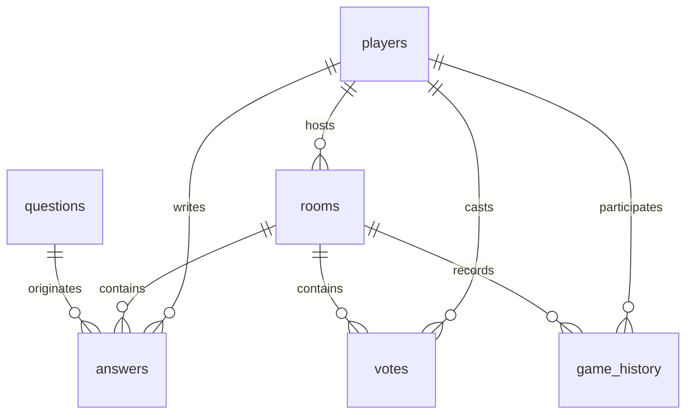
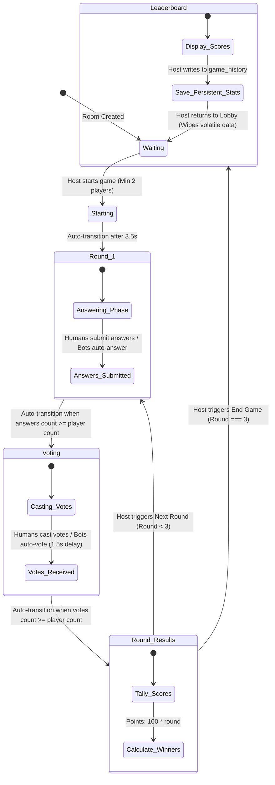

# 🎮 JXOVO Project Knowledge Base & System Architecture
### *Single Source of Truth (SSOT) for MVP & Future Development*

---

## 🌌 1. System Overview & Architecture Paradigm

JXOVO is a fast-paced, highly interactive, multiplayer social party game built to function natively across both mobile-first messenger ecosystems and standard web browsers. It is optimized for speed, real-time synchronization, and zero-friction entry.

```
                  ┌──────────────────────────────────────┐
                  │          Vercel Deployment           │
                  │   (Next.js App Router Core / React)  │
                  └──────────────────┬───────────────────┘
                                     │
                     ┌───────────────┴───────────────┐
                     ▼                               ▼
       ┌───────────────────────────┐   ┌───────────────────────────┐
       │   Telegram Mini App (TMA) │   │     Web Browser Client     │
       │   - Injected WebApp SDK   │   │     - Standard routing    │
       │   - startapp deep linking │   │     - ?room= deep linking │
       └─────────────┬─────────────┘   └─────────────┬─────────────┘
                     │                               │
                     └───────────────┬───────────────┘
                                     │ (HTTPS / Supabase JS / WSS)
                                     ▼
                  ┌──────────────────────────────────────┐
                  │       Supabase Backend Service       │
                  │  - PostgreSQL RDBMS                  │
                  │  - Realtime Engine (Websockets)      │
                  │  - Static Storage Asset CDN          │
                  └──────────────────────────────────────┘
```

The system is designed with a **dual-environment architecture**:
1. **Telegram Mini App (TMA) Mode:** Runs embedded inside the Telegram messenger. Automatically extracts user authorization context (User ID, First Name) directly from the secure `window.Telegram.WebApp.initDataUnsafe` payload.
2. **Web Browser Fallback Mode:** Runs inside any modern browser. Generates temporary guest identities on-the-fly via high-entropy client-side UUID generation and manages session state via persistence hooks.

Both modes share the identical frontend routing, rendering, state management, and real-time backend subscription channels.

---

## 🛠️ 2. Tech Stack & Infrastructure

The application leverages a lean, modern, serverless real-time tech stack engineered for maximum performance, horizontal scaling, and ultra-low latency.

| Layer | Technology | Details |
| :--- | :--- | :--- |
| **Core Framework** | **Next.js 15 (App Router)** | Utilizes React 19, Client Component state trees, and dynamic API endpoints for Telegram webhook handling. |
| **Frontend Styling** | **Tailwind CSS** | Built with fully responsive grid/flex layouts, glassmorphism filters, smooth animations (`animate-in`, `fade-in`, `zoom-in`), and dark mode colors optimized for OLED displays. |
| **Hosting & CDN** | **Vercel** | Edge network deployment ensuring minimal latency worldwide with serverless functions for background integrations. |
| **Database Engine** | **Supabase (PostgreSQL)** | RDBMS storing persistent records for players, static assets, game history, and question banks. |
| **Realtime Engine** | **Supabase Realtime** | Real-time event propagation utilizing Postgres Write-Ahead Logging (WAL) replicated over persistent secure WebSocket connections. |
| **Static Assets CDN** | **Supabase Storage** | Delivers public static images, game covers, and avatars through a global edge caching system. |

---

## ⚡ 3. Core Architectural Rules & Design Decisions

To ensure system stability, seamless multi-platform support, and rapid expandability, several foundational design rules must be rigidly maintained:

> [!IMPORTANT]
> **Rule 1: Strict TEXT Representation of Player IDs (Eradication of UUID constraint)**
> All player identities across `players`, `rooms.host_id`, `rooms.users_ids`, `answers`, `votes`, and `game_history` tables **must** be stored as `TEXT` (`VARCHAR` compatible) rather than PostgreSQL `UUID`. 
> * **Rationale:** When a player connects from Telegram, the system captures their numeric Telegram User ID (e.g., `519485023`) and maps it directly as their primary key. Web-fallback clients receive a standard stringified UUID. Restricting the database columns to the PostgreSQL `UUID` type would break Telegram integrations.

> [!TIP]
> **Rule 2: Distinct Bot Identification via ID Prefixes**
> Bots are fully supported to allow single-player testing or fill lobbies. All bot instances must have their IDs prefixed with `bot_` (e.g., `bot_1716300054_384`).
> * **Rationale:** Prefixed IDs allow instant frontend-only distinction between humans and simulated players (e.g., hiding game interfaces from bots, auto-submitting answers/votes by the Host on behalf of bots, and appending the distinct `БОТ` label in the UI).

* **Rule 3: Single-Host Serverless Authority Model:** The client who creates the room becomes the `Host`. The host client's device acts as the single coordinator for state transitions (e.g., selecting questions, processing bot decisions, starting rounds, and triggering database cleanups). Other players passively listen for database row changes in the `rooms` table via real-time WebSocket channels.
* **Rule 4: Zero Database Orphans via Cascading Deletes:** All room-specific data (e.g., submitted answers and cast votes) has a foreign key constraint referencing `rooms.room_code` with `ON DELETE CASCADE`. When the Host deletes room metadata or transitions the room back to the `Waiting` lobby, all stale transactional round details are instantly purged at the database engine level.

---

## 📊 4. Database Schema & Relational Model

The relational architecture comprises persistent tables (for player metrics and static content) and volatile, high-throughput tables (for active game coordination).



### Table Structure & Definitions

#### `public.players`
Stores player records. Accommodates both standard Telegram accounts and web fallbacks.
* `id` (**TEXT, Primary Key**): Telegram User ID or standard UUID.
* `nickname` (**TEXT, NOT NULL**): Display name.
* `total_score` (**INT, Default: 0**): Cumulative score over all played games.
* `games_played` (**INT, Default: 0**): Total count of finished game lobbies.
* `avatar_id` (**INT, Nullable**): Reference index for visual icons.

#### `public.rooms`
Represents the active lobby state, current round coordinates, and host associations.
* `room_code` (**VARCHAR(4), Primary Key**): Unique uppercase alphanumeric code (e.g., `ABCD`).
* `status` (**TEXT, NOT NULL**): State constraint containing `Waiting`, `Starting`, `Round 1`, `Voting`, `Round Results`, or `Leaderboard`.
* `host_id` (**TEXT, NOT NULL**): References `players(id)` on delete cascade.
* `users_ids` (**TEXT[] / Array of Strings**): Dynamic list of all joined player IDs.
* `users_num` (**INT, Default: 1**): Total count of joined players (cached for rapid frontend size queries).
* `current_question_id` (**UUID, Nullable**): References `questions(id)` on delete set null.
* `current_round` (**INT, Nullable**): Standard round index (`1`, `2`, or `3`).

#### `public.questions`
Static question bank loaded with creative, humorous queries.
* `id` (**UUID, Primary Key, Default: uuid_generate_v4()**): Unique identifier.
* `question_text` (**TEXT, NOT NULL**): The question prompt shown to players.
* `fake_answers` (**TEXT[] / Array of Strings**): Pre-compiled humorous answers injected for bot responses.
* `category` (**TEXT, Nullable**): Categorization tag.

#### `public.answers`
Volatile table storing text answers submitted during active rounds.
* `id` (**UUID, Primary Key, Default: uuid_generate_v4()**): Unique identifier.
* `question_id` (**UUID, NOT NULL**): References `questions(id)` on delete cascade.
* `user_id` (**TEXT, NOT NULL**): References `players(id)` on delete cascade.
* `room_code` (**VARCHAR(4), NOT NULL**): References `rooms(room_code)` on delete cascade.
* `answer_text` (**TEXT, NOT NULL**): Raw text response submitted by player.

#### `public.votes`
Volatile table storing voter choices.
* `id` (**UUID, Primary Key, Default: uuid_generate_v4()**): Unique identifier.
* `answer_id` (**UUID, NOT NULL**): References `answers(id)` on delete cascade.
* `user_id` (**TEXT, NOT NULL**): References `players(id)` on delete cascade.
* `room_code` (**VARCHAR(4), NOT NULL**): References `rooms(room_code)` on delete cascade.

#### `public.game_history`
Persistent log for historical matching, analytics, and global leaderboards.
* `id` (**BIGINT, Primary Key, Generated Always as Identity**): Sequential record key.
* `room_code` (**VARCHAR(4), NOT NULL**): The code of the finished room.
* `player_id` (**TEXT, NOT NULL**): References `players(id)` on delete cascade.
* `score_earned` (**INT, NOT NULL**): Points accumulated in that single session.
* `created_at` (**TIMESTAMP WITH TIME ZONE, Default: now()**): Creation log.

---

## 🔄 5. State Machine & Game Loop

The entire gameplay cycle is modeled as an automated host-driven state machine. All players monitor the database room record and react in real-time.

### State Transition Diagram



### 🎮 The 3-Round Game Loop Mechanics

1. **The Round Structure:**
   * JXOVO is structured around a **3-round cycle**. Each round progresses through three successive phases: `Round 1/2/3` (Answering) ➡️ `Voting` ➡️ `Round Results`.

2. **Dynamic Scoring Multipliers:**
   * To build tension and incentivize late-game comebacks, points scale linearly with the round number.
   * Every vote cast for a player's answer awards points directly to that player:
     $$\text{Points Earned per Vote} = 100 \times \text{Current Round Number}$$
   * **Score Matrix:**
     * **Round 1:** $1 \times 100 = 100\text{ points per vote}$
     * **Round 2:** $2 \times 100 = 200\text{ points per vote}$
     * **Round 3:** $3 \times 100 = 300\text{ points per vote}$

3. **Bot Integration Pipeline:**
   * **Answering Phase:** When the host transitions the lobby to a round status, the Host's device fetches the question's pre-compiled array of `fake_answers`. It assigns a randomized answer from the pool to each bot in the lobby and inserts those answers into the database.
   * **Voting Phase:** When voting options load, the Host's device schedules simulated votes for all active bots. After a brief $1.5\text{s}$ delay (simulating thinking time), it inserts the bot votes into the database. To maintain game integrity, **bots are programmatically blocked from voting for their own answers.**

---

## 🔒 6. Race-Condition Defense & Local State Hygiene

Developing multiplayer architectures on serverless real-time layers exposes systems to network desynchronizations and race conditions. JXOVO mitigates this through strict defensive mechanisms.

### 🛡️ Double-Checked DB Transitions (Host Gatekeeper)
If state transitions relied purely on a simple React state value or an optimistic counter, a network delay could cause a host's machine to double-trigger transitions or proceed with missing data.
To prevent this, before executing any transition (`Round 1 -> Voting` or `Voting -> Round Results`), the Host's engine performs a server-side SQL check:

```typescript
// Excerpt from Host's verification before transitioning to Voting
const { data: currentAnswers, error: checkError } = await supabase
  .from('answers')
  .select('id')
  .eq('room_code', roomCode)
  .eq('question_id', room.current_question_id!);

if (!currentAnswers || currentAnswers.length < players.length) {
  console.log(`Transition aborted: Only ${currentAnswers?.length || 0}/${players.length} answers in DB.`);
  return; // Halted to prevent race-condition transition
}
```

The Host will **abort the transition** if the server-side row count is less than the current player size. This pattern is applied similarly to the voting-to-results transition.

### 🧹 Client-Side Local State Hygiene
When moving between game phases, any leftover state in a client's memory can bleed through to the next phase, causing flickering, outdated metrics, or incorrect submission blocks. 
To prevent state leaks, clients listen for round, status, and question updates on the Supabase Realtime channel and execute a thorough state purge:

```typescript
// Strict state hygiene trigger on phase transition
useEffect(() => {
  setHasAnswered(false);
  setAnswerText('');
  setIsSubmittingAnswer(false);
  setHasVoted(false);
  setIsSubmittingVote(false);
  setVotingOptions([]);
  setSubmittedAnswersCount(0);
  setSubmittedVotesCount(0);
  setRoundResults([]);
  botsVotedRef.current = false;
}, [room?.status, room?.current_round, room?.current_question_id]);
```

### 🧹 Post-Game Lobby Cleanup
When the Host restarts a game by returning to the lobby (`status = 'Waiting'`), the system performs a database cleanup. It deletes all volatile `votes` and `answers` referencing the active room code, sets `current_question_id` and `current_round` to `null` inside the `rooms` row, resets client-side scores, and clears played questions refs to allow full replayability.

---

## 🔗 7. Cross-Platform Deep Linking Routing Protocol

JXOVO features a unified landing route (`/`) that parses external joining coordinates and redirects users straight into active lobbies.

```
                                  USER ACCESS PATHWAY
                                           │
                ┌──────────────────────────┴──────────────────────────┐
                ▼                                                     ▼
     Telegram Mini App Link                                     Web Browser Link
  [t.me/JXOVO_bot/jxovo?startapp=ABCD]                      [jxovo.app/?room=ABCD]
                │                                                     │
                ▼                                                     ▼
     TMA Host initializes SDK                                 NextJS URL Search
   & reads start_param property                                  Query Params
                │                                                     │
                └──────────────────────────┬──────────────────────────┘
                                           ▼
                            Route: '/' home component mounts
                                           │
                                           ▼
                        - Autofills Join Code = 'ABCD'
                        - Fetches user metadata / name
                        - Restores active room/user to local storage
                                           │
                                           ▼
                     Router pushes destination: '/room/ABCD'
```

### Code Implementation Excerpt

```typescript
useEffect(() => {
  let deepLinkRoomCode: string | null = null;
  
  // 1. Standard Web Query Parameters
  if (typeof window !== 'undefined') {
    const urlParams = new URLSearchParams(window.location.search);
    deepLinkRoomCode = urlParams.get('room');
  }

  // 2. Telegram Mini App Payload Injection
  if (typeof window !== 'undefined' && (window as any).Telegram?.WebApp) {
    const webApp = (window as any).Telegram.WebApp;
    if (webApp.initData) {
      webApp.ready();
      setIsTelegramEnv(true);
      const tgUser = webApp.initDataUnsafe?.user;
      if (tgUser) {
        if (tgUser.first_name) {
          setJoinNickname(tgUser.first_name);
          setHostNickname(tgUser.first_name);
        }
        if (tgUser.id) {
          setTelegramUserId(String(tgUser.id));
        }
      }
      
      // Extract deep link from Telegram start_param
      if (webApp.initDataUnsafe?.start_param) {
        deepLinkRoomCode = webApp.initDataUnsafe.start_param;
      }
    }
  }

  if (deepLinkRoomCode) {
    setJoinCode(deepLinkRoomCode);
    setActiveTab('join');
  }
}, []);
```

---

## 💡 8. Future-Proofing & Developer Operations

### ⚠️ React Hydration Mismatch Solutions
The integration of Telegram's client-side SDK (`window.Telegram.WebApp`) introduces layout changes before Next.js completes its server-client hydration. To avoid hydration errors, developers must follow these patterns:
* **The `suppressHydrationWarning` Attribute:** Always attach `suppressHydrationWarning` to the root `<html>` element inside `src/app/layout.tsx`.
* **Safe Mounting Checks:** Only access window-level Telegram objects inside `useEffect` hooks that execute purely after the client has safely mounted.
* **Loading Strategy:** Load the Telegram webapp script inside `layout.tsx` using `next/script` with a `beforeInteractive` strategy to ensure properties are available immediately when components mount:
  ```typescript
  <Script src="https://telegram.org/js/telegram-web-app.js" strategy="beforeInteractive" />
  ```

### 📱 Responsive Viewport Scaling & Styling
Telegram Mini Apps inject dynamic custom headers and bottom navbars that shift the viewport height.
* Do not use fixed, absolute pixel constraints for height structures.
* Always style screens using Tailwind's fluid height parameters, such as `min-h-screen` or `h-full` wrapped in parent layouts styled with `flex flex-col` and `overflow-hidden`.
* Use backdrop filter classes (`backdrop-blur-sm`, `backdrop-blur-md`) and translucent overlays (`bg-neutral-900/50`, `bg-neutral-900/60`) to maintain readability across diverse chat background themes.

### 🔌 Realtime Scaling Instructions
If developers introduce additional tables in future sprints, they must register them in the Supabase Realtime publication schema, otherwise subscription events will not propagate. To enable realtime sync, execute this inside the database query console:
```sql
ALTER PUBLICATION supabase_realtime ADD TABLE your_new_table_name;
```
